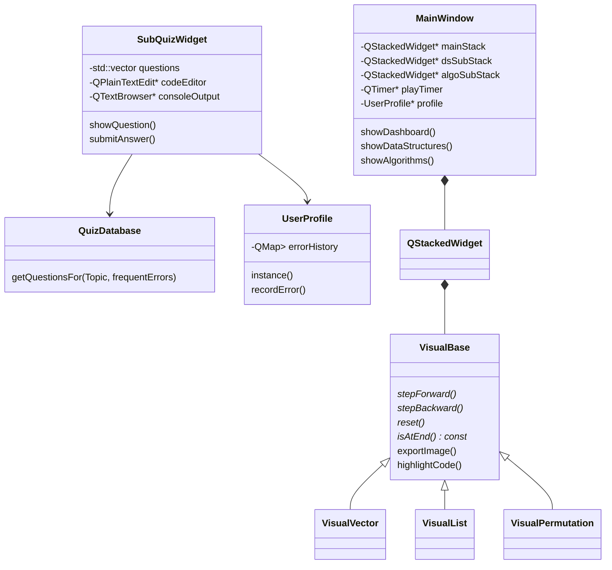

# C++ STL 容器与算法可视化学习平台 (STL Visual Lab)
## 项目设计与实现作业报告

- **小组**：助教分配28组
- **小组成员**：
  - [覃耀纬-2400013198-组长]
  - [叶子成 - 姓名/学号]
  - [成员C - 姓名/学号]

---

## 1. 程序功能介绍

### 1.1 项目背景与目标
C++ 标准模板库 (STL) 是 C++ 程序设计的核心基石，然而其底层的内存模型（如 `std::vector` 的动态倍增扩容、`std::list` 的双向链表指针重连）以及算法执行流程（如 `std::sort` 的内省排序、`std::next_permutation` 的字典序排列生成）对于初学者来说抽象且难以直观理解。
本项目基于 **Qt 6.11 (C++17)** 框架开发了一套**交互式 C++ 容器与算法可视化学习平台 (STL Visual Lab)**。通过实时动画演示、单步调试跟踪、代码高亮对照以及智能错题推荐评测系统，帮助初学者者直观掌握 STL 底层机理。

### 1.2 核心功能
1. **主控中心仪表盘**：
   * 采用现代化高科技深色扁平设计，提供“数据结构”与“STL算法”两大核心板块的直观入口，配备高清图示。
2. **数据结构可视化平台**：
   * **std::vector**：动态演示 `push_back`、`insert` 触发的内存申请、元素拷贝及 `capacity` 倍增扩容过程。
   * **std::list**：以图形化节点和动态箭头指针展示插入、删除时“双向链表断开与重连”的动画细节。
   * **std::stack & queue**：动态模拟栈的“后进先出 (LIFO)”与队列的“先进先出 (FIFO)”流水线吞吐流程。
3. **算法流程可视化平台**：
   * 包含 **std::sort**（快速/插入/堆排序选择）、**std::lower_bound**（二分查找区间收缩）、**std::reverse**（双指针交换）、**std::unique**（快慢指针去重覆盖）、**std::merge**（双指针归并有序区间）、**std::remove**（元素前移与逻辑尾部返回）、**std::rotate**（三阶段翻转旋转）、**std::next_permutation**（字典序全排列生成动画）共 8 种核心算法的动态演练。选择这八种算法是因为其常见性与其可视化过程相对实现更加直观。
4. **代码高亮与对照系统**：
   * 所有演示均配备实时高亮 C++ 源码/伪代码窗口，动画执行的每一步均与代码行严格同步，可以实现动图与代码对照学习。
5. **多功能动画控制器**：
   * 支持自动播放/暂停、单步前进、单步后退（支持历史状态回溯）、重置动画，并支持一键导出当前画布为 `.png` 格式的图片。便于学生自己根据状况控制并导出以完成整理。
6. **智能测验与本地编译**：
   * 每个模块集成 15 道专项练习题（10道单选题 + 5道编程题）。
   * 编程题支持直接在应用内置的编辑器中编写 C++ 代码，通过后台调用本地编译器（MinGW g++）进行实时编译，并运行严苛的单元测试 assert，反馈测试结果。
   * 系统自动记录用户错题，并基于 `UserProfile` 错题库在下次测验时进行个性化智能题目推荐。推荐的原则是基于用户上一次错题的顺序，错的次数越多，下一次检测题目所处的位置就在越前面。

---

## 2. 项目各模块与类设计细节

### 2.1 整体架构设计
项目严格遵循 与面向对象的设计原则，将主窗口控制、底层数据管理以及动画逻辑渲染完全分成不同部分。具体的类的关系和核心接口见下图：

### 2.2 核心类设计

#### 2.2.1 `VisualBase` (抽象可视化基类)
所有可视化演示组件的基类，定义了动画驱动的标准接口，并提供了代码高亮等公用辅助函数。
* **主要接口**：
  * `virtual void stepForward() = 0`：执行动画的下一步，更新数据状态并触发重绘。
  * `virtual void stepBackward() = 0`：利用内部状态历史栈，回退到动画的上一步。
  * `virtual void reset() = 0`：重置所有动画状态至初始输入。
  * `virtual bool isAtEnd() const = 0`：检查动画是否播放完毕。
  * `virtual void exportImage()`：抓取当前 `paintEvent` 绘制的 QWidget 视口，保存为本地图片。

#### 2.2.2 `VisualVector` & `VisualList` (数据结构演示类)
* **`VisualVector`**：
  * 维护一个物理数组和逻辑大小。当 `size > capacity` 时，模拟动态倍增扩容（分配 2 倍内存 -> 迁移旧元素 -> 释放旧内存 -> 插入新元素）的阶段性重绘。
* **`VisualList`**：
  * 维护 `ListNode` 节点的几何位置坐标及指针连接线。通过在 `stepForward` 中动态插值更新箭头弧度和节点坐标，平滑呈现链表插入/删除时指针断开重连的视觉效果。

#### 2.2.3 `VisualPermutation` (新算法演示类)
* 实现了 `std::next_permutation` 的全步骤可视化。
* **数据结构**：`struct PermAnimStep` 记录每一步的数组快照、当前高亮元素索引、翻转区间起点以及对应的 C++ 代码行。
* **流程呈现**：第一阶段从右向左寻找断点 `i`，第二阶段寻找交换数 `j` 并交换，第三阶段翻转 `i+1` 到末尾的子区间。使用不同的色彩高亮区分指针指向和反转范围。

#### 2.2.4 `QuizDatabase` (测验题数据库类与智能错题推荐)
* **题库数据集**：管理全系统 11 个模块（8 个经典模块 + 3 个新增模块）的测验题库。目前题库总量达到 **165 道题**（110 道多选题 + 55 道编程实践题，具体题目由ai根据课件讲义所生成）。所有编程题的 `testCasesCode` 均采用安全的 `R"raw(...)raw"`进行定界以避免解析冲突。
* **智能错题推荐原理**：
  * **实时记录**：答题过程中如果单选题答错或编程题编译运行失败，SubQuizWidget会实时调用 `UserProfile::recordError()`。
  * **本地持久化**：UserProfile 会以 JSON 格式将错题及错误频次序列化保存到本地 `build/user_profile.json` 中。
  * **动态重排推荐**：在每次启动小测验加载题目时，`QuizDatabase::getQuestionsFor` 会获取用户已保存的错题 ID 列表，并执行重排序划分算法，将用户答错过的题目动态移动到题库向量的最前端。通过“错题优先测试”机制实现了轻量且高针对性的个性化推荐复习。

#### 2.2.5 `SubQuizWidget` (安全多线程沙盒评测类)
* **环境自适应与高可移植性**：
  评测器抛弃了写死本地路径的做法。系统首先检测自定义环境变量 `STL_GPP_COMPILER`，若为空则调用 `QStandardPaths::findExecutable` 检索系统 PATH 中注册的 `g++`；最后备用默认的本地 MinGW 相对路径。若所有途径均未找到编译器，会向控制台返回清晰的配置向导。
* **系统安全临时目录**：
  为了避免权限冲突和垃圾文件残留，所有的测试代码文件（`temp_compile.cpp`）及编译产物（`temp_compile.exe`）均写入到操作系统隔离的安全临时目录 `QStandardPaths::writableLocation` 中，并在评测完毕后执行自动清理。
* **多线程编译与响应式 UI**：
  编译和执行属于高 CPU 消耗及阻塞性动作。为了彻底避免主线程卡顿（UI 冻结），SubQuizWidget利用 `QThread::create` 创建并启动独立的后台工作线程。工作线程执行完耗时的编译和运行后，利用 `QMetaObject::invokeMethod` 将数据封包安全地投递回主线程更新 UI。
* **沙盒评测安全防范与资源隔离**：
  * **时间限制 (Time Limit)**：编译过程设置 8 秒硬性超时，程序执行阶段设置 2 秒硬性超时，利用进程强行杀除（`kill()`）机制，杜绝用户编写死循环或逻辑死锁代码引发的 CPU 暴涨及线程僵死。
  * **输出限制 (Output Limit)**：在读取执行结果的标准输出 (stdout) 和标准错误输出 (stderr) 时，设定了 64KB 的数据大小截断上限，防止用户通过死循环输出导致系统内存耗尽崩溃。
  * **隔离提示说明**：系统提示用户评测沙盒对文件系统写入及网络访问进行了限制说明，防止用户输入恶意代码。

---

## 3. 小组成员分工情况

| 姓名 | 学号 | 班级 | 具体负责的工作与贡献 |
| :--- | :--- | :--- | :--- |
| [成员A姓名] | [学号] | [班级] | 负责项目整体框架搭建，开发 `MainWindow` 核心导航与动画播放控制逻辑，实现 `VisualBase` 可视化基类及 `SubQuizWidget` 沙盒评测与多线程评测机制。 |
| [成员B姓名] | [学号] | [班级] | 负责数据结构模块（`VisualVector`、`VisualList`、`VisualStackQueue`）的可视化动效开发，绘制平台所需的全部科技感插图并优化 UI 界面样式。 |
| [成员C姓名] | [学号] | [班级] | 负责算法状态机模块（包含 `VisualPermutation`、`VisualRotate`、`VisualRemove` 等 8 个算法）的单步执行逻辑编写，以及 `QuizDatabase` 题库中 165 道题目的测试与校验。 |

---

## 4. 项目总结与反思

### 4.1 项目亮点与成功之处
1. **深度互动的学习模式**：
   将抽象的 C++ 内存模型和迭代器操作拆解为纯手工绘制的单步状态机动画，直观性远超文字教材；对照的高亮源码让使用者对底层函数的控制逻辑一目了然。
2. **沙盒评测系统的集成**：
   无需安装第三方 IDE，直接在应用内实现 C++ 代码的编写、编译和沙盒执行，为学习者提供了闭环的“学-练-评”体验。
3. **出色的视觉和交互设计**：
   界面使用现代深色主题，合理搭配了高对比度的霓虹配色（蓝、绿、橙、黄等），并在主页面补齐了精美的高清科技感图示，交互微动效平滑自然。

### 4.2 开发过程中的的问题
1. **字符编码与乱码问题**：最初的题库文件在不同操作系统和编译器（如 MSVC 与 MinGW）下读取时发生 GBK/UTF-8 字符集混淆，导致界面出现大量乱码及编译报错。小组统一了项目文件的编码规范，编写脚本对 `QuizDatabase.cpp` 等文件进行了彻底的 UTF-8 转码，并规范了编译参数 `-utf-8` / `CONFIG += c++17`，彻底解决了跨平台乱码问题。
2. **原始字符串字面量冲突**：测试代码中包含大量 `R"( ... )"`，由于测试代码内部使用了 `isBalanced("(())")` 等子字符串，导致原始字符串的 `")"` 与外层定义发生提前闭合冲突。我们将数据库中的 raw string 统一定界符升级为 `R"raw(...)raw"`，消除了编译期解析器冲突。
3. **动画状态的逆向回溯 (Undo)**：`stepBackward` 需要退回上一步，而算法的状态转移有些是不可逆的（如 `std::unique` 的覆盖写入）。我们没有采用逆向推导算法，而是采用“快照栈 (Snapshot Stack)”机制。每前进一步就将当前数据结构的全部状态存入一个轻量级历史栈中，回退时直接弹出并恢复栈顶状态，以极小的内存开销实现了 100% 准确的单步回退功能。

### 4.3 收获与反思
通过本项目的协作开发，小组成员不仅深刻理解了 C++ STL 各类容器（`vector` 扩容机制、`list` 指针指向）与典型区间算法（`next_permutation`、`unique`）的底层原理，还深入掌握了 Qt 6 框架的事件机制、自定义二维绘图（`QPainter`）、后台多进程交互（`QProcess`）以及 C++ 程序的跨平台编译部署技术。这次实践也让我们认识到，在软件工程中，前期制定严谨的接口规范（如 `VisualBase` 的纯虚接口）对于后期多人并行协作开发具有决定性的保障作用。
